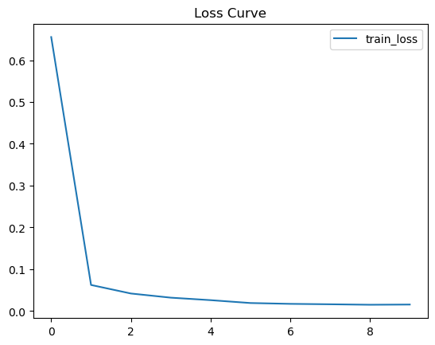
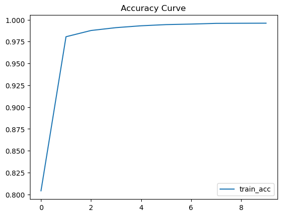
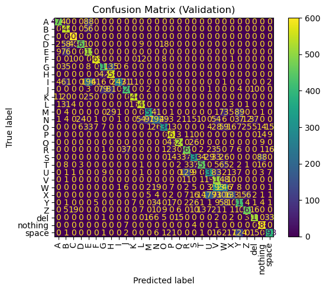

```python
import os
import tensorflow as tf
from tensorflow.keras.preprocessing.image import ImageDataGenerator
```


```python
# Image size for resizing all inputs
img_size = (64, 64)    # you can increase to (128,128) or (224,224) if GPU allows

# Batch size for training (used if you go with generators)
batch_size = 32

# Random seed for reproducibility
seed = 123
```


```python
data_dir = "/Users/shahimpanjwani/Desktop/archive/asl-ai/asl_alphabet_train/asl_alphabet_train"
```


```python
classes = os.listdir(data_dir)
```


```python
print("Number of classes:", len(classes))
```

    Number of classes: 30


```python
classes = [d for d in os.listdir(data_dir) if os.path.isdir(os.path.join(data_dir, d))]
classes.sort()

print(classes)
print("Total classes:", len(classes))
```

    ['A', 'B', 'C', 'D', 'E', 'F', 'G', 'H', 'I', 'J', 'K', 'L', 'M', 'N', 'O', 'P', 'Q', 'R', 'S', 'T', 'U', 'V', 'W', 'X', 'Y', 'Z', 'del', 'nothing', 'space']
    Total classes: 29


```python
datagen = ImageDataGenerator(rescale=1.0/255)
```


```python
from tensorflow.keras.preprocessing.image import ImageDataGenerator
datagen = ImageDataGenerator(rescale=1./255, validation_split=0.2)

train_data = datagen.flow_from_directory(
    data_dir,
    target_size=img_size,
    batch_size=batch_size,
    class_mode='categorical',
    subset='training',         # 👈 added
    seed=123,                  # 👈 added (reproducible)
    shuffle=True
)

val_data = datagen.flow_from_directory(
    data_dir,
    target_size=img_size,
    batch_size=batch_size,
    class_mode='categorical',
    subset='validation',       # 👈 added
    seed=123,
    shuffle=False              # 👈 keep False so labels line up with predictions
)
```

    Found 69600 images belonging to 29 classes.
    Found 17400 images belonging to 29 classes.


```python
print(train_data.class_indices)
```

    {'A': 0, 'B': 1, 'C': 2, 'D': 3, 'E': 4, 'F': 5, 'G': 6, 'H': 7, 'I': 8, 'J': 9, 'K': 10, 'L': 11, 'M': 12, 'N': 13, 'O': 14, 'P': 15, 'Q': 16, 'R': 17, 'S': 18, 'T': 19, 'U': 20, 'V': 21, 'W': 22, 'X': 23, 'Y': 24, 'Z': 25, 'del': 26, 'nothing': 27, 'space': 28}


```python
from tensorflow.keras import layers, models
model = models.Sequential()
```


```python
model.add(layers.Input(shape=(64, 64, 3)))

# First conv block 
model.add(layers.Conv2D(32,(3,3), activation ='relu', input_shape=(64,64,3)))
model.add(layers.MaxPooling2D((2,2)))

# Second conv block
model.add(layers.Conv2D(64,(3,3), activation='relu'))
model.add(layers.MaxPooling2D((2,2)))

# Third conv block
model.add(layers.Conv2D(128,(3,3), activation='relu'))
model.add(layers.MaxPooling2D(2,2))

# Now we flatten to 1D for fully connected layers
model.add(layers.Flatten())
model.add(layers.Dense(128, activation='relu'))
model.add(layers.Dense(29, activation='softmax'))

print("we just dubbed without errors")
```

    we just dubbed without errors


    /opt/anaconda3/lib/python3.12/site-packages/keras/src/layers/convolutional/base_conv.py:113: UserWarning: Do not pass an `input_shape`/`input_dim` argument to a layer. When using Sequential models, prefer using an `Input(shape)` object as the first layer in the model instead.
      super().__init__(activity_regularizer=activity_regularizer, **kwargs)
    2025-08-25 11:51:02.552001: I metal_plugin/src/device/metal_device.cc:1154] Metal device set to: Apple M3
    2025-08-25 11:51:02.552242: I metal_plugin/src/device/metal_device.cc:296] systemMemory: 16.00 GB
    2025-08-25 11:51:02.552261: I metal_plugin/src/device/metal_device.cc:313] maxCacheSize: 5.33 GB
    2025-08-25 11:51:02.552442: I tensorflow/core/common_runtime/pluggable_device/pluggable_device_factory.cc:305] Could not identify NUMA node of platform GPU ID 0, defaulting to 0. Your kernel may not have been built with NUMA support.
    2025-08-25 11:51:02.552465: I tensorflow/core/common_runtime/pluggable_device/pluggable_device_factory.cc:271] Created TensorFlow device (/job:localhost/replica:0/task:0/device:GPU:0 with 0 MB memory) -> physical PluggableDevice (device: 0, name: METAL, pci bus id: <undefined>)


```python
model.compile(
    optimizer='adam',
    loss='categorical_crossentropy',
    metrics=['accuracy']
)
```


```python
history = model.fit(train_data, epochs=10)
```

    Epoch 1/10


    /opt/anaconda3/lib/python3.12/site-packages/keras/src/trainers/data_adapters/py_dataset_adapter.py:121: UserWarning: Your `PyDataset` class should call `super().__init__(**kwargs)` in its constructor. `**kwargs` can include `workers`, `use_multiprocessing`, `max_queue_size`. Do not pass these arguments to `fit()`, as they will be ignored.
      self._warn_if_super_not_called()
    2025-08-25 11:51:06.104388: I tensorflow/core/grappler/optimizers/custom_graph_optimizer_registry.cc:117] Plugin optimizer for device_type GPU is enabled.
    2025-08-25 11:51:06.107927: E tensorflow/core/grappler/optimizers/meta_optimizer.cc:961] PluggableGraphOptimizer failed: INVALID_ARGUMENT: Failed to deserialize the `graph_buf`.


    2175/2175 ━━━━━━━━━━━━━━━━━━━━ 42s 19ms/step - accuracy: 0.5765 - loss: 1.4498
    Epoch 2/10
    2175/2175 ━━━━━━━━━━━━━━━━━━━━ 41s 19ms/step - accuracy: 0.9754 - loss: 0.0789
    Epoch 3/10
    2175/2175 ━━━━━━━━━━━━━━━━━━━━ 42s 19ms/step - accuracy: 0.9851 - loss: 0.0498
    Epoch 4/10
    2175/2175 ━━━━━━━━━━━━━━━━━━━━ 42s 19ms/step - accuracy: 0.9899 - loss: 0.0361
    Epoch 5/10
    2175/2175 ━━━━━━━━━━━━━━━━━━━━ 41s 19ms/step - accuracy: 0.9942 - loss: 0.0207
    Epoch 6/10
    2175/2175 ━━━━━━━━━━━━━━━━━━━━ 41s 19ms/step - accuracy: 0.9949 - loss: 0.0164
    Epoch 7/10
    2175/2175 ━━━━━━━━━━━━━━━━━━━━ 41s 19ms/step - accuracy: 0.9963 - loss: 0.0126
    Epoch 8/10
    2175/2175 ━━━━━━━━━━━━━━━━━━━━ 41s 19ms/step - accuracy: 0.9961 - loss: 0.0138
    Epoch 9/10
    2175/2175 ━━━━━━━━━━━━━━━━━━━━ 42s 19ms/step - accuracy: 0.9954 - loss: 0.0168
    Epoch 10/10
    2175/2175 ━━━━━━━━━━━━━━━━━━━━ 42s 19ms/step - accuracy: 0.9968 - loss: 0.0123


```python
import matplotlib.pyplot as plt

plt.plot(history.history['loss'], label='train_loss')
plt.legend()
plt.title("Loss Curve")
plt.show()

plt.plot(history.history['accuracy'], label='train_acc')
plt.legend()
plt.title("Accuracy Curve")
plt.show()
```


    

    


    

    


```python
import numpy as np
from sklearn.metrics import confusion_matrix, ConfusionMatrixDisplay, classification_report
import matplotlib.pyplot as plt

# Ground-truth labels (already in order since shuffle=False)
y_true = val_data.classes

# Predictions over the whole validation set
y_prob = model.predict(val_data)
y_pred = y_prob.argmax(axis=1)

# Class names in the correct index order
classes = list(val_data.class_indices.keys())

cm = confusion_matrix(y_true, y_pred)
ConfusionMatrixDisplay(cm, display_labels=classes).plot(xticks_rotation="vertical")
plt.title("Confusion Matrix (Validation)")
plt.show()

print(classification_report(y_true, y_pred, target_names=classes))
```

     13/544 ━━━━━━━━━━━━━━━━━━━━ 7s 13ms/step

    2025-08-25 11:58:07.961695: E tensorflow/core/grappler/optimizers/meta_optimizer.cc:961] PluggableGraphOptimizer failed: INVALID_ARGUMENT: Failed to deserialize the `graph_buf`.


    544/544 ━━━━━━━━━━━━━━━━━━━━ 7s 12ms/step


    

    


                  precision    recall  f1-score   support
    
               A       0.94      0.79      0.86       600
               B       0.61      0.91      0.73       600
               C       0.89      1.00      0.94       600
               D       0.93      0.77      0.84       600
               E       0.55      0.86      0.67       600
               F       0.91      0.95      0.93       600
               G       0.74      0.69      0.72       600
               H       0.69      0.93      0.80       600
               I       0.99      0.41      0.58       600
               J       0.83      0.70      0.76       600
               K       0.95      0.91      0.93       600
               L       0.87      0.92      0.89       600
               M       0.74      0.59      0.66       600
               N       0.57      0.32      0.41       600
               O       0.79      0.56      0.65       600
               P       0.80      0.94      0.86       600
               Q       0.94      0.87      0.91       600
               R       0.70      0.78      0.74       600
               S       0.69      0.56      0.62       600
               T       0.86      0.76      0.80       600
               U       0.58      0.56      0.57       600
               V       0.44      0.85      0.58       600
               W       0.35      0.41      0.38       600
               X       0.59      0.22      0.32       600
               Y       0.59      0.70      0.64       600
               Z       0.82      0.78      0.80       600
             del       0.86      0.86      0.86       600
         nothing       0.80      0.98      0.88       600
           space       0.82      0.66      0.73       600
    
        accuracy                           0.73     17400
       macro avg       0.75      0.73      0.73     17400
    weighted avg       0.75      0.73      0.73     17400
    

